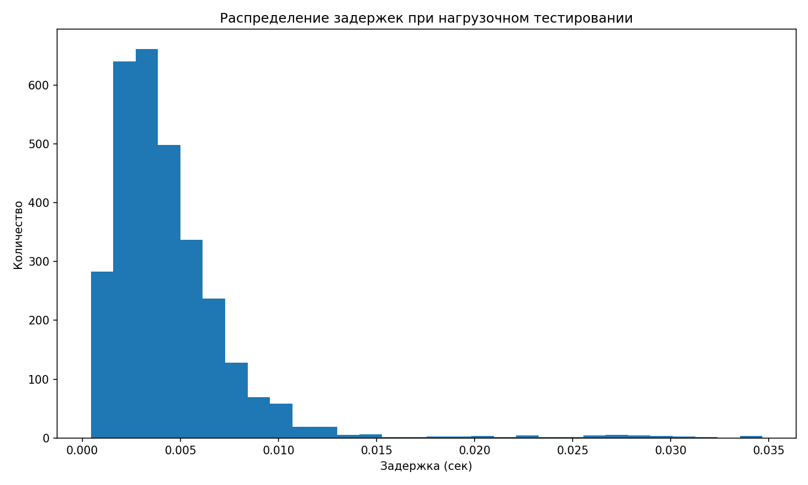

# Итоговое задание по модулю 3

## Описание проекта

В рамках проекта реализована распределённая база данных MongoDB для университетской информационной системы.

Система предназначена для хранения данных о студентах, курсах, заданиях, сдачах работ, оценках и посещаемости

В проекте выполнены:
- развёртывание **sharded cluster MongoDB**
- создание коллекций с валидацией по **JSON Schema**
- настройка индексов
- загрузка тестовых данных
- реализация **Python CLI** для работы с данными
- проведение нагрузочного тестирования
- проверка фактического распределения данных между shard-узлами

---

## Структура проекта

```text
final_dz/
├── app/
│   ├── __init__.py
│   ├── db.py
│   └── cli.py
├── schemas/
│   ├── students.schema.json
│   ├── courses.schema.json
│   ├── assignments.schema.json
│   ├── submissions.schema.json
│   ├── grades.schema.json
│   └── attendances.schema.json
├── scripts/
│   ├── create_collections.py
│   ├── create_indexes.py
│   ├── seed_data.py
│   └── init_sharded_cluster.sh
├── tests/
│   ├── load_test.py
│   └── results/
├── docker-compose.sharded.yml
├── .env
├── requirements.txt
└── README.md
````

## Архитектура кластера

Кластер MongoDB состоит из следующих компонентов:

* **configsvr** — config server replica set, хранит метаданные кластера
* **shard1** — первый shard replica set
* **shard2** — второй shard replica set
* **mongos** — роутер, через который приложение выполняет запросы к кластеру

### Используемые порты

* `configsvr` → `27019`
* `shard1` → `27018`
* `shard2` → `27028`
* `mongos` → внешний порт `27020`, внутренний `27017`

---

## Коллекции базы данных

В системе используются следующие коллекции:

* `students`
* `courses`
* `assignments`
* `submissions`
* `grades`
* `attendances`

### Краткое описание коллекций

**students**
Хранит информацию о студентах: идентификатор, имя, фамилию, email и курс обучения

**courses**
Содержит список учебных курсов: код, название, описание и количество кредитов

**assignments**
Содержит задания по учебным курсам

**submissions**
Хранит данные о сдаче работ студентами

**grades**
Содержит оценки студентов по заданиям

**attendances**
Хранит информацию о посещаемости занятий


---

## Индексация

Для ускорения запросов были созданы индексы по часто используемым полям.
Индексация применяется для:

* поиска студентов по email
* поиска submission по `course_id`
* расчёта средней оценки студента
* выборок по `student_id`, `course_id`, `assignment_id`

---

## Шардинг

Шардинг был настроен для двух наиболее объёмных и активно изменяемых коллекций:

### 1. `submissions`

Shard key:

```javascript
{ course_id: 1, student_id: 1, assignment_id: 1 }
```

Причины выбора:

* коллекция быстро растёт
* запросы часто фильтруются по курсу и студенту
* составной ключ позволяет логично распределять данные между shard-узлами

### 2. `attendances`

Shard key:

```javascript
{ course_id: 1, student_id: 1, date: 1 }
```

Причины выбора:

* посещаемость накапливается во времени
* запросы часто выполняются по курсу, студенту и дате
* составной ключ удобен для диапазонных выборок и распределения данных

---

## Подготовка окружения

Создание виртуального окружения:

```bash
python -m venv .env
source .env/bin/activate
```

Установка зависимостей:

```bash
pip install -r requirements.txt
```

---

## Файл `.env`

В корне проекта необходимо создать файл `.env`:

```env
MONGO_URI=mongodb://localhost:27020/
MONGO_DB=university_db
```

---

## Запуск sharded cluster

### 1. Поднять контейнеры

```bash
docker compose -f docker-compose.sharded.yml up -d
```

### 2. Инициализировать кластер

```bash
bash scripts/init_sharded_cluster.sh
```

### 3. Проверить статус

```bash
docker exec -it mongos mongosh --port 27017
```

Внутри `mongosh`:

```javascript
sh.status()
```

---

## Создание коллекций

```bash
PYTHONPATH=. python scripts/create_collections.py
```

Пример результата:

```text
[SKIP] students уже существует
[OK] обновлен валидатор для students
[SKIP] courses уже существует
[OK] обновлен валидатор для courses
[SKIP] assignments уже существует
[OK] обновлен валидатор для assignments
[SKIP] submissions уже существует
[OK] обновлен валидатор для submissions
[SKIP] grades уже существует
[OK] обновлен валидатор для grades
[SKIP] attendances уже существует
[OK] обновлен валидатор для attendances
```

Скрипт:

* создаёт коллекции, если они отсутствуют
* обновляет валидаторы, если коллекции уже существуют

---

## Создание индексов

```bash
PYTHONPATH=. python scripts/create_indexes.py
```

Пример результата:

```text
[OK] индексы созданы
```

---

## Генерация тестовых данных

```bash
PYTHONPATH=. python scripts/seed_data.py --students 1000 --courses 20 --assignments 100
```

Пример результата:

```text
[OK] тестовые данные вставлены
students: 1000
courses: 20
assignments: 100
submissions: 3000
grades: 3000
attendances: 5000
```

---

## Проверка подключения приложения

Проверка подключения Python-приложения к MongoDB:

```bash
python -c "from app.db import get_db; db=get_db(); print(db.name); print(db.client.admin.command('ping'))"
```

Пример результата:

```text
university_db
{'ok': 1.0, '$clusterTime': {'clusterTime': Timestamp(1773344472, 1), 'signature': {'hash': b'\x00\x00\x00\x00\x00\x00\x00\x00\x00\x00\x00\x00\x00\x00\x00\x00\x00\x00\x00\x00', 'keyId': 0}}, 'operationTime': Timestamp(1773344472, 1)}
```

---

## CLI-интерфейс

Для работы с данными реализован консольный интерфейс.

Запуск:

```bash
PYTHONPATH=. python app/cli.py
```

Доступные функции:

1. Показать 5 студентов
2. Найти студента по email
3. Показать курсы
4. Показать сдачи по `course_id`
5. Средняя оценка студента

Пример работы:

```text
=== Mongo CLI ===
1. Показать 5 студентов
2. Найти студента по email
3. Показать курсы
4. Показать сдачи по course_id
5. Средняя оценка студента
0. Выход

Выбор: 1
{'age': 21,
 'course_id': 2,
 'email': 'student1@example.com',
 'name': 'Автоном',
 'student_id': 1,
 'surname': 'Копылов',
 'university_course_id': 2}
{'age': 18,
 'course_id': 6,
 'email': 'student2@example.com',
 'name': 'Ипполит',
 'student_id': 2,
 'surname': 'Дорофеев',
 'university_course_id': 6}
{'age': 23,
 'course_id': 16,
 'email': 'student3@example.com',
 'name': 'Станислав',
 'student_id': 3,
 'surname': 'Соколова',
 'university_course_id': 16}
{'age': 22,
 'course_id': 4,
 'email': 'student4@example.com',
 'name': 'Борислав',
 'student_id': 4,
 'surname': 'Лазарева',
 'university_course_id': 4}
{'age': 26,
 'course_id': 11,
 'email': 'student5@example.com',
 'name': 'Моисей',
 'student_id': 5,
 'surname': 'Орехова',
 'university_course_id': 11}
```

Далее выводится список курсов, после чего можно завершить работу CLI.

---

## Нагрузочное тестирование

Для проверки производительности был запущен скрипт:

```bash
PYTHONPATH=. python tests/load_test.py --operations 3000 --workers 20
```

Результат выполнения:

```text
operation  avg_latency_sec  max_latency_sec  min_latency_sec  count  throughput_ops_per_sec
aggregate         0.004350         0.034671         0.000522    976              408.544395
     read         0.004474         0.034490         0.000433   2024              408.544395
      ALL         0.004434         0.034671         0.000433   3000              408.544395

Общее время выполнения теста: 7.3431 сек
Производительность (throughput): 408.54 операций/сек
Файлы с результатами сохранены в каталоге: tests/results
```

### Интерпретация результатов

По итогам тестирования система показала стабильную работу при 3000 операциях и 20 потоках.
Средняя задержка операций чтения составила `0.004474 sec`, средняя задержка агрегирующих запросов — `0.004350 sec`, а общая пропускная способность достигла `408.54 ops/sec`.

### График результатов нагрузочного тестирования



---

## Проверка шардинга

Для проверки использовались команды:

```javascript
use university_db
db.students.countDocuments()
db.courses.countDocuments()
sh.status()
```

### Количество загруженных данных

```text
db.students.countDocuments() -> 1000
db.courses.countDocuments() -> 20
```

### Результат `sh.status()`

Проверка показала, что:

* в кластере успешно зарегистрированы оба шарда
* балансировщик включён
* миграция chunk’ов между shard-узлами выполнена успешно

Фрагмент вывода:

```text
shards
[
  {
    _id: 'shard1ReplSet',
    host: 'shard1ReplSet/shard1:27018',
    state: 1
  },
  {
    _id: 'shard2ReplSet',
    host: 'shard2ReplSet/shard2:27028',
    state: 1
  }
]
```

### Распределение данных между шардами

#### Коллекция `attendances`

* `shard1ReplSet` — **2256** документов
* `shard2ReplSet` — **2744** документов

#### Коллекция `submissions`

* `shard1ReplSet` — **1398** документов
* `shard2ReplSet` — **1602** документов

Это подтверждает, что:

* коллекция `submissions` распределена между `shard1ReplSet` и `shard2ReplSet`
* коллекция `attendances` также распределена между двумя shard-узлами
* шардинг не только включён формально, но и реально используется для распределения данных
